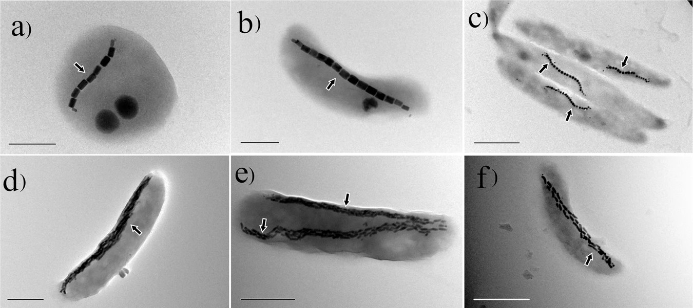
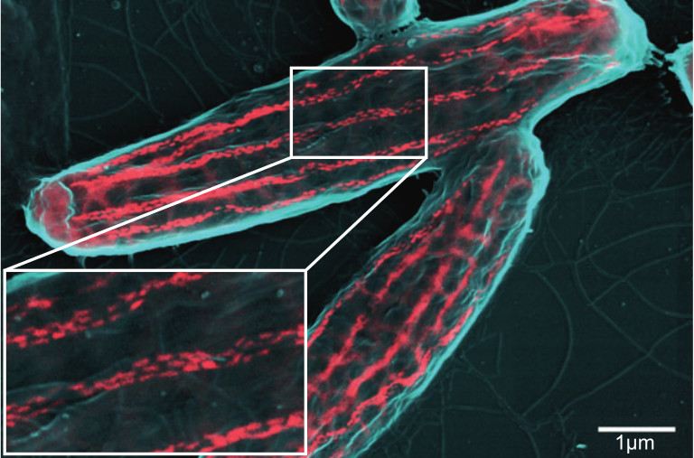

Ever since the invention of the magnetic compass, we have used the magnetic field to help us find our way around the Earth. However, we are not the first organisms to use the magnetic field to our advantage. Some Proteobacteria mysteriously are always aligned to the Earth's north- and southpole.

---
{: data-content="The needle"}

These bacteria contain a magnetic needle which forces them into this alignment. This needle is made from several small magnetosomes. Magnetosomes are small membrane-enclosed compartments. These compartments contain magnetic crystals. By compartmentalising the crystals, these bacteria have high amounts of control of the mineralization process and the positioning of the magnetosomes within the cell. The positioning is important as the most stable state of multiple magnetosomes is to cluster together. In order to form a needle, the magnetosomes are chained together through a cytoskeletal protein called MamK. The cytoskeleton of a cell is formed by a complex network of filaments. It gives internal structure and is responsible for the shape of a cell. The details of how the bacterial cytoskeleton constructs the magnetosomes into a needle-like structure are not well understood. A lot of research is therefore focused on understanding this interplay better as it shows a form of complexity in bacteria akin to eukaryotes.

---
{: data-content="Electron microscope images of bacteria with magnetosome"}

The magnetosomes are black and indicated by the arrows. Scale bars: a, b = 0.5 μm, c–f = 1 μm. Image from [P. Goswami, 2022](https://doi.org/10.1038/s41522-022-00304-0).

---
{: data-content="Magnetosome genes"}

MamK is not the only protein involved in the formation of functional magnetosomes. About 32 genes, some of which have partially redundant functions, in bacterium *Magnetospirillum gryphiswaldense MSR-1* are involved in magnetosome formation[^1]. That might sound like a lot but considering how complex these magnetosomes are, it seems rather little. Besides, not all 32 are necessary for magnetosome formation; 17 of these 32 are sufficient to get some rudimentary magnetosome formation. To show how little 32 proteins really are for a system as complex as magnetosomes, here is a small comparison: All 32 of these proteins are encoded by around 29000 nucleotides, which is equivalent to 58000 bits of data or 7.25 kilobytes. For reference, the text alone in this post already uses 5.8 kilobytes.

---
{: data-content="SEM micrograph of *Magnetobacterium bavaricum*"}

The magnetosomes are visualised in red. Image from [C. Jogler, 2010](https://doi.org/10.1111/j.1462-2920.2010.02220.x).

---
{: data-content="Function"}

So why do these bacteria have these large and complex magnetosomes? The common answer you will find is that it helps the bacterium to find its prefered oxygen concentration. However, the function of the magnetosomes is more complex in reality as it seems tightly integrated with responses to other environmental factors, such as light. How does the alignment help these bacteria to find their preferred environmental conditions? The magneto-aerotactic hypothesis states that in a stratified environment a one-dimensional search type movement, which we observe in magnetosome-containing bacteria, is more efficient than the three-dimensional random walk type movement that most other bacteria show. In the case of oxygen, these bacteria like to be near the sediment layer of the oceans as they prefer low oxygen levels. The magnetic field has a vertical component which points downwards towards the sediment. The magnetic field lines therefore guide the bacterium towards the sediment. This can't fully explain the possible advantage of magnetosomes as near the equator the magnetic field lines have no vertical component. Besides, the responses to all environmental factors might be affected as the bacterium can't simply turn off its north-south alignment. It is therefore still not entirely clear for me what advantage the north-south alignment provides.

---
{: data-content="More information"}

The magnetosome research field is relatively large with many papers. Here are few to start with if you are interested in more:

Schüler D. (2008). Genetics and cell biology of magnetosome formation in magnetotactic bacteria. FEMS microbiology reviews, 32(4), 654–672. <https://doi.org/10.1111/j.1574-6976.2008.00116.x>

Uebe, R., & Schüler, D. (2016). Magnetosome biogenesis in magnetotactic bacteria. Nature reviews. Microbiology, 14(10), 621–637. <https://doi.org/10.1038/nrmicro.2016.99>

Frankel, R. B., Blakemore, R. P., DE Araujo, F. F., Esquivel, D. M., & Danon, J. (1981). Magnetotactic bacteria at the geomagnetic equator. Science (New York, N.Y.), 212(4500), 1269–1270. <https://doi.org/10.1126/science.212.4500.1269>

Pfeiffer, D., & Schüler, D. (2020). Quantifying the Benefit of a Dedicated "Magnetoskeleton" in Bacterial Magnetotaxis by Live-Cell Motility Tracking and Soft Agar Swimming Assay. Applied and environmental microbiology, 86(3), e01976-19. <https://doi.org/10.1128/AEM.01976-19>

Klumpp, S., Faivre, D (2016). Magnetotactic bacteria. Eur. Phys. J. Spec. Top. 225, 2173–2188. <https://doi.org/10.1140/epjst/e2016-60055-y>

Bazylinski D. A. (1999). Synthesis of the bacterial magnetosome: the making of a magnetic personality. International microbiology : the official journal of the Spanish Society for Microbiology, 2(2), 71–80.

---
{: data-content="footnotes"}

[^1]: mamM, mamB, mamE, mamZ, mamJ, mamA, mamX, mamL, mamQ, mms6, mamO, mamC, mamF, mamD, mamH, mamT, mamI, mamG, mamY, mamN, mamR, mmsF, mms48, mamS, mms36, mms5, ftsZ-like, mamK, mamP, MamU, FeoA1, FeoB1