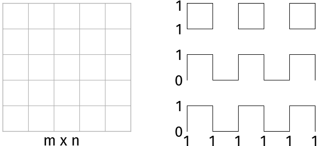
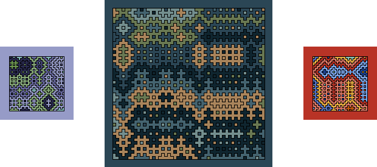
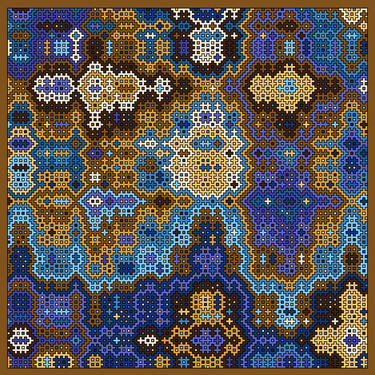
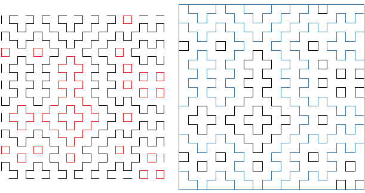
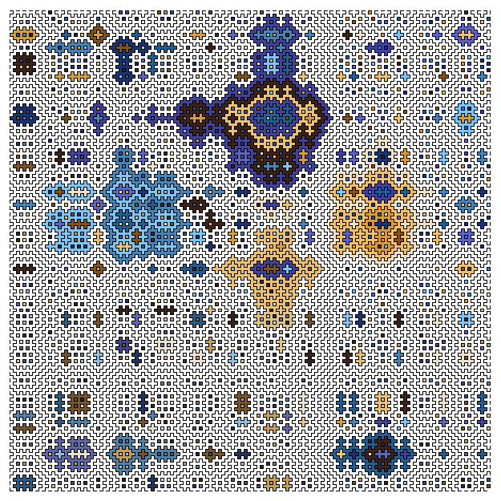
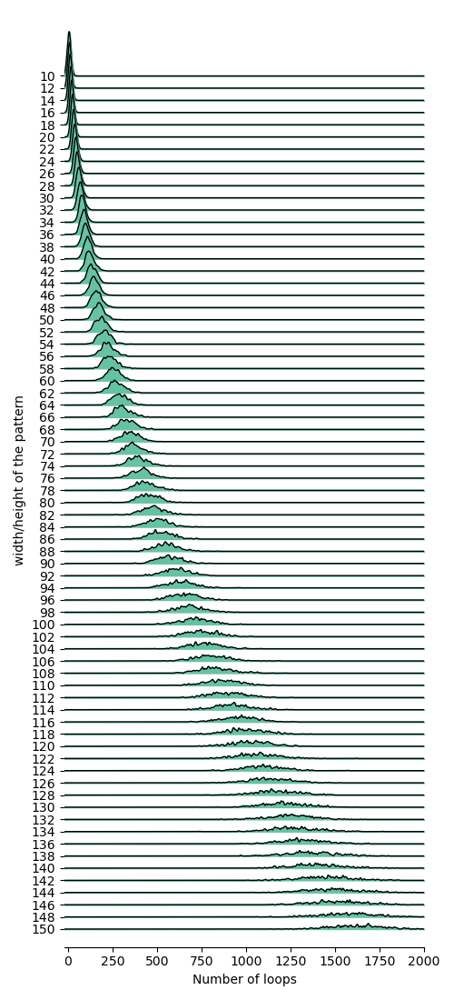
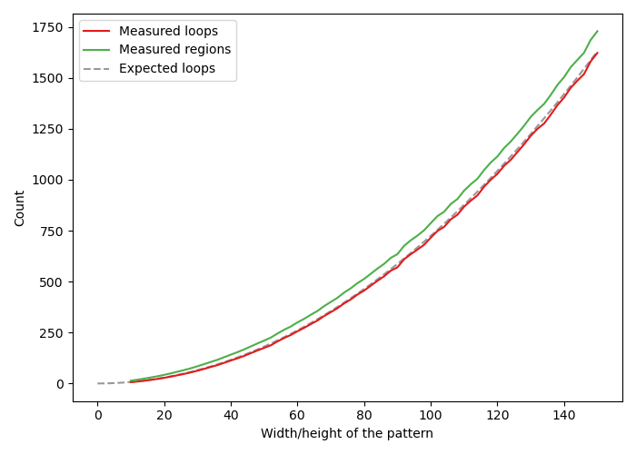

*Hitomezashi* is a type of Japanese *sashiko* embroidery, where stitches are regularly spaced from each other on a canvas.
The patterns that result from these stitches have caught attention of many sewing enthusiasts and mathematicians, due to their beautiful appearance and interesting mathematical properties.

I first came across a hitomezashi pattern in [a YouTube video from Brady Haran's channel "Numberphile"](https://www.youtube.com/watch?v=JbfhzlMk2eY), wherein mathematician Ayliean MacDonald demonstrates how to draw them on paper:

1. Start with an m x n grid
2. At $$m=0,1,2,...$$ and $$n=0,1,2,...$$, you either start with drawing a line/"stitch" (1) or a gap (0).
3. Continue drawing either lines or gaps, alternating between the two.

Tiling is one of my favorite math subjects due to the striking visual component of it.
Inspired by the Numberphile video, I made a small script which can generate these hitomezashi patterns.
On a white background, the patterns can be difficult to see, so I decided to also automatically color them in, drawing colors randomly from defined color palettes:

I like how the smaller patterns have a painting-like feel to them.
The larger patterns look more wild, and with a bright and strong color palette they become quit trippy:

---
{: data-content="Loops and boundary regions"}

Hitomezashi patterns exhibit some interesting properties.
For example, a loop, which is a closed curve formed by the stitches, always has an odd width and height (Defant, 2024).

In the 20x20 hitomezashi pattern above, I have colored all loops red.
Note that all of these loops have an odd width and height.
On the right, I have colored all boundary regions blue.
These are regions that become "loops" because of the frame that has been added around the pattern.
However, because the boundary regions are not only formed by stitches but also by the boundary itself we don't consider them to be loops.
So, how many loops are formed in a hitomezashi pattern?

In the figure above, only the loops are colored for a 150x150 hitomezashi pattern. 
By eye, you might guess that there are a few hundred loops, but if you count them there are 1431.
The majority of the loops are the small 1x1 loops, but it is the large loops that catch our attention, which is probably the reason why it is hard to correctly guess the number of loops.
To get an idea of the average number of loops and boundary regions as a function of $$m$$ and $$n$$, I generated 500 square hitomezashi patterns for $$m = n = 10, 12, 14, ..., 150$$.
The distributions of the loops are plotted below.

Two things jump out:
1. the number of loops increases exponentially
2. the standard deviation also grows as a function of $$m$$

Loops increasing exponentially is expected as the area of the hitomezashi pattern grows exponentially as $$m$$ grows linearly.
More precisely, the total number of loops is expected to grow like (Defant, 2024):

$$ \dfrac{\pi - 9}{12} * m * n $$

When we plot the mean number of loops against $$m$$, we see indeed that this holds true.

I have also plotted the mean number of regions.
The difference between the number of regions and the number of loops is the number of boundary regions.
From the plot above we can conclude the that boundary regions only make up a small part of the total number of regions in a hitomezashi pattern.
So how many boundary regions are there as a function of width and height of the pattern?
We expect there to be a linear relationship, and this is indeed what we find when we plot the number of boundary regions against $$m$$.

From the fit, we find that the number of boundary regions is about equal to $$0.357528765 * (m + n)$$.

---
{: data-content="Follow-up questions"}

The hitomezashi patterns that I have discussed here, and the data associated with them, have an equal change to start with a gap or a stitch at $$m=0,1,2,...$$ and $$n=0,1,2,...$$.

I am interested to see how the number of regions and loops change as starting with a stitch becomes more or less likely.

---
{: data-content="Source code"}

You can find my hitomezashi code here:
[https://github.com/SamuelSchwab/hitomezashi](https://github.com/SamuelSchwab/hitomezashi)

---
{: data-content="References"}

Defant, C., & Kravitz, N. (2024). Loops and regions in Hitomezashi patterns. Discrete Mathematics, 347(1), 113693. https://doi.org/10.1016/j.disc.2023.113693